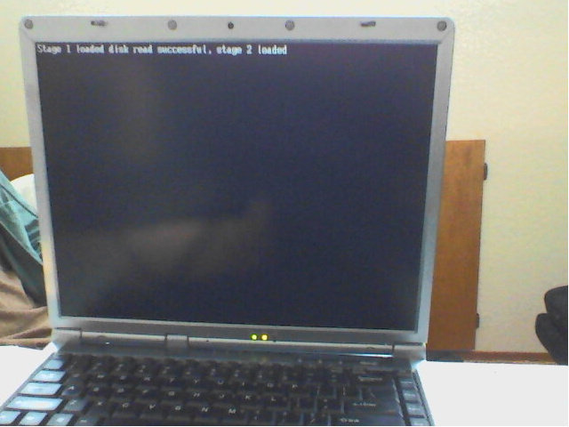

# ExoOS - An operating system project

ExoOS is currently just a two stage bootloader prototype, Im currently working on a GDT in the background so stay tuned and it might get uploaded soon, meanwhile have fun doin what you're doin.

DISCLAMER:
Iso works but is not a tradition iso, just floppy image in an iso file.

## Prerequisites

1. MUST have the 'nasm' package installed
2. MUST have the 'make' package installed
3. MUST have the 'qemu-desktop' package installed
4. MUST have the 'dosfstools' package installed
5. MUST have the 'coreutils' package installed (Usually installed on linux by default)
6. MUST have the 'cdrtools' package installed
7. IF you desire to edit the code, have a text editor, any will do.

### for arch linux
```bash
sudo pacman -S --needed nasm make qemu-desktop dosfstools coreutils cdrtools
```
### for debian-based systems (ubuntu, kali, parrot, mint, etc.)
```bash
sudo apt update && sudo apt install -y nasm make qemu-system-x86 qemu-utils dosfstools coreutils genisoimage
```
### for fedora/REHL/CentOS
```bash
sudo dnf install -y nasm make qemu-system-x86 qemu-img dosfstools coreutils cdrtools
```
### for OpenSUSE
```bash
sudo zypper install -y nasm make qemu-x86 qemu-tools dosfstools coreutils cdrtools
```
### for Gentoo
```bash
emerge --ask dev-lang/nasm sys-apps/coreutils sys-fs/dosfstools app-cdr/cdrtools app-emulation/qemu
```

### for windows
install wsl and a distro (I recommend ubuntu) and follow the corresponding tutorial

### for mac
¯\ _(ツ)_/¯

## Compiling

1. make sure you are in the root of the project directory
2. run code below
```bash
make buildOS
```

## Booting

 1. make sure you are in the root of the project directory
 2. run code below

### for booting DRIVE
```bash
make boot_drive
```
### for booting FLOPPY
```bash
make boot_floppy
```
### for booting CD (isnt working yet.)
```bash
make boot_cd
```

## Clearing build DIR

1. make sure you are in the root of the project directory
2. run code below

```bash
make clean
```

## If you wish to copy and paste less you can use this command

```bash
make all & boot_drive
# boot_drive is recommended due to the fact it boots floppy and uses a qemu drive (.qcow2)
```

## Minimum specs

CPU: 32-bit or 64-bit
GPU: none
RAM: 8mb
STORAGE: >2kb

## Recommended specs

>potato

Image of development as of 17 Jan 2026 18:56


Image of development as of 29 June 2026 16:23



